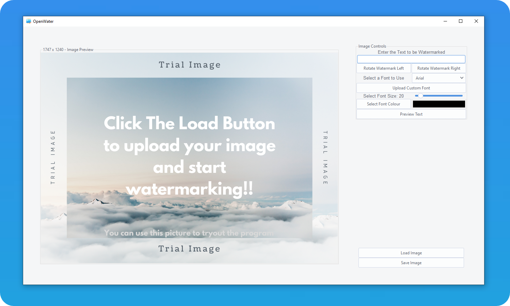
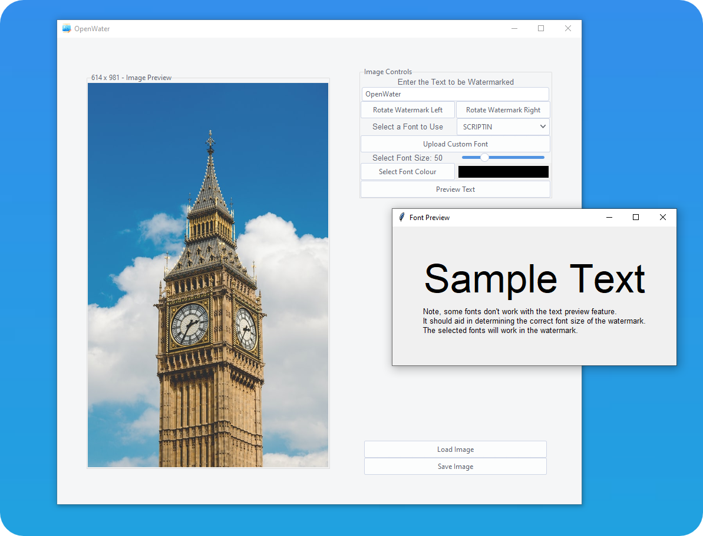
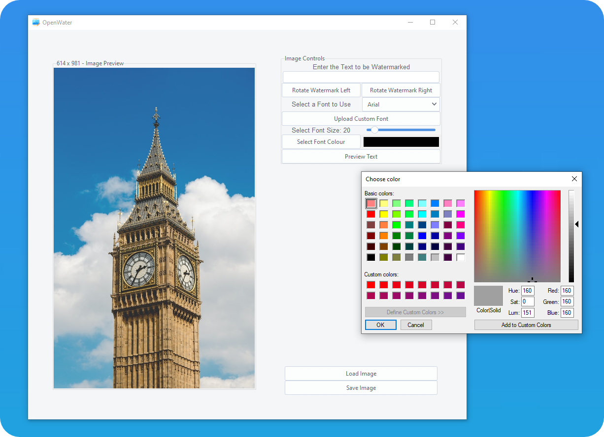
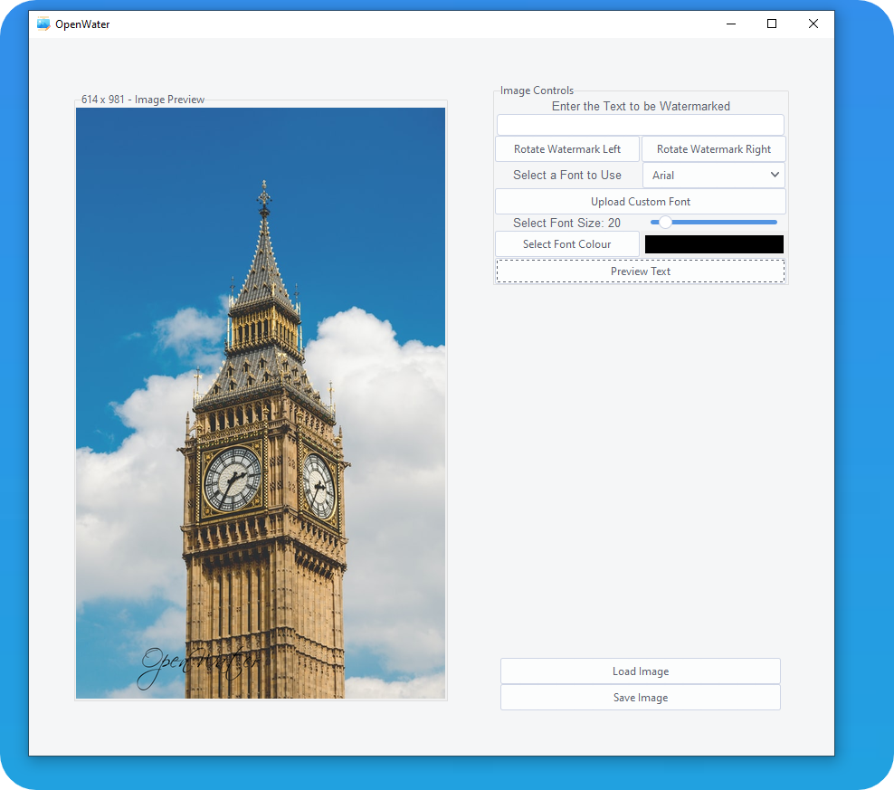

[![Forks][forks-shield]][forks-url]
[![Issues][issues-shield]][issues-url]
[![MIT License][license-shield]][license-url]

<!-- PROJECT LOGO -->
 

  

  <h3 align="center">OpenWater</h3>

  

    A opensource imagewatermarking app.
     
    <a href="https://github.com/github_username/repo_name">View Demo</a>
    ·
    <a href="https://github.com/YOULOF2/OpenWater/issues">Report Bug</a>
    ·
    <a href="https://github.com/YOULOF2/OpenWater/issues">Request Feature</a>
  

<!-- TABLE OF CONTENTS -->

  
<h2 style="display: inline-block">Table of Contents</h2>

  <ol>
    <li>
      <a href="#about-the-project">About The Project</a>
      <ul>
        <li><a href="#built-with">Built With</a></li>
      </ul>
    </li>
    <li>
      <a href="#getting-started">Getting Started</a>
      <ul>
        <li><a href="#prerequisites">Prerequisites</a></li>
        <li><a href="#installation">Installation</a></li>
      </ul>
    </li>
    <li><a href="#Features">Screenshots</a></li>
    <li><a href="#roadmap">Roadmap</a></li>
    <li><a href="#contributing">Contributing</a></li>
    <li><a href="#license">License</a></li>
    <li><a href="#contact">Contact</a></li>
    <li><a href="#acknowledgements">Acknowledgements</a></li>
  </ol>

<!-- ABOUT THE PROJECT -->
## About The Project

#OpenWater

An Opensource image watermarking app that I decided to make, in more than **30 Hours**.

This project streched the boundaries of my Python skills and my willpower.
I am very pround of the current state of the app, but it is still a work in progress, 
and I hope to make it more user-friendly in the future

### Built With

* [Python](https://www.python.org/)
* [PILLOW](https://pillow.readthedocs.io/en/stable/index.html)
* [Tkinter](https://docs.python.org/3/library/tkinter.html)

<!-- GETTING STARTED -->
## Getting Started

To get a local copy up and running follow these simple steps.

### Prerequisites

Currently, to use the app, python 3.9 is required to be installed on your machine.

### Installation

1. Download the ZIP file and extract it in a folder.
2. Make sure that the file heirchy is the same as that of the git repository.

## Features

Simple and intuitive UI

Text Size preview UI

Multiple Colour settings

Beautiful results

<!-- CONTRIBUTING -->
## Contributing

Contributions are what make the open source community such an amazing place to be learned, inspire, and create. Any contributions you make are **greatly appreciated**.

1. Fork the Project
2. Create your Feature Branch (`git checkout -b feature/AmazingFeature`)
3. Commit your Changes (`git commit -m 'Add some AmazingFeature'`)
4. Push to the Branch (`git push origin feature/AmazingFeature`)
5. Open a Pull Request

<!-- LICENSE -->
## License

Distributed under the MIT License. See `LICENSE` for more information.

[comment]: <> (<!-- MARKDOWN LINKS & IMAGES -->)

[comment]: <> (<!-- https://www.markdownguide.org/basic-syntax/#reference-style-links -->)

[comment]: <> ([contributors-shield]: https://img.shields.io/github/contributors/github_username/repo.svg?style=for-the-badge)

[comment]: <> ([contributors-url]: https://github.com/github_username/repo/graphs/contributors)

[comment]: <> ([forks-shield]: https://img.shields.io/github/forks/github_username/repo.svg?style=for-the-badge)

[comment]: <> ([forks-url]: https://github.com/github_username/repo/network/members)

[comment]: <> ([stars-shield]: https://img.shields.io/github/stars/github_username/repo.svg?style=for-the-badge)

[comment]: <> ([stars-url]: https://github.com/github_username/repo/stargazers)

[comment]: <> ([issues-shield]: https://img.shields.io/github/issues/github_username/repo.svg?style=for-the-badge)

[comment]: <> ([issues-url]: https://github.com/github_username/repo/issues)

[comment]: <> ([license-shield]: https://img.shields.io/github/license/github_username/repo.svg?style=for-the-badge)

[comment]: <> ([license-url]: https://github.com/github_username/repo/blob/master/LICENSE.txt)

[comment]: <> ([linkedin-shield]: https://img.shields.io/badge/-LinkedIn-black.svg?style=for-the-badge&logo=linkedin&colorB=555)

[comment]: <> ([linkedin-url]: https://linkedin.com/in/github_username)
